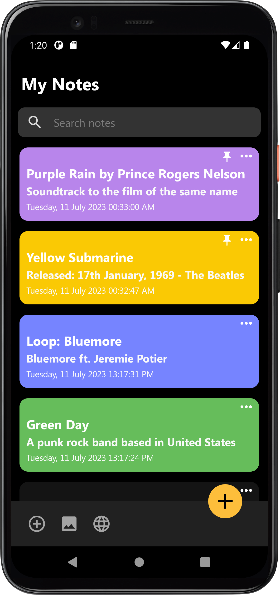

# Notes
Android Local Storage Notes App

## App features
- CRUD notes
- Pin notes
- Add image and url to notes
- Customize notes color
- Search notes

## Supported languages
- English 
- Vietnamese

## Screenshots
  
  
   

## Technical information
- Database: Room database
- Permissions:
  * Read media images (API 33+)
  * Read external storage (API 32-)
- MinSdk: 21
- TargetSdk: 33
## Authors
- [@ngtienndungg](https://github.com/ngtienndungg)
